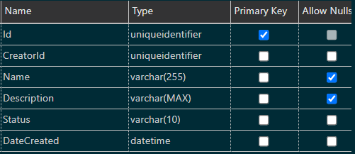
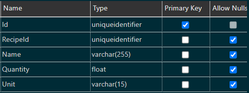
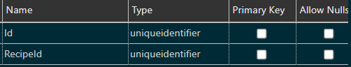
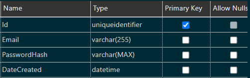

# ShopGen

This repo contains the source code for my personal project, [ShopGen](https://shopgen.tremorrisdev.com)

## Conception

ShopGen was born in an effort to get me to waste less time aimlessly wandering grocery stores during my weekly grocery shopping trips.
The basic idea is that one may register for the site, build their recipes for the things the frequently eat, make a plan for what meals they would like for the week
(or any duration realistically), and generate a shopping list to help keep grocery shopping brief and focused.

No more writing lists by hand, just select a few meals and generate your list.

## Configuration

ShopGen has a few out-of-source configuration files to run the site locally. If you'd like you can produce these and run the site yourself.

### [shop-gen/ShopGen](https://github.com/tremorris1999/shop-gen/tree/main/ShopGen)/.env

The only necessary environment variable that needs to be defined is `VITE_API`. This should point to where ShopGen.API is being hosted.

```c
VITE_API=url_to_api /** {http/https/localhost:port} */
```

### [shop-gen/ShopGen.API](https://github.com/tremorris1999/shop-gen/tree/main/ShopGen.API)/appsettings.json

The backend needs a few more variables set. For the ConnectionStrings requirements, please see [DataAdapterSharp](https://github.com/tremorris1999/DataAdapterSharp).

```json
... /** other configuration */

ConnectionStrings: {
  "key": "value" /** connection string to your database  */
},
Urls: "url_for_hosting:port", /** {http/https/localhost}:port */
Keys: {
  "HashKey": "encryption_string_for_passwords" /** can use any string here */
}
```

## Schema

The schema for the database looks like the following:

### Recipe



### RecipeIngredient



### RecipeImage



### User


